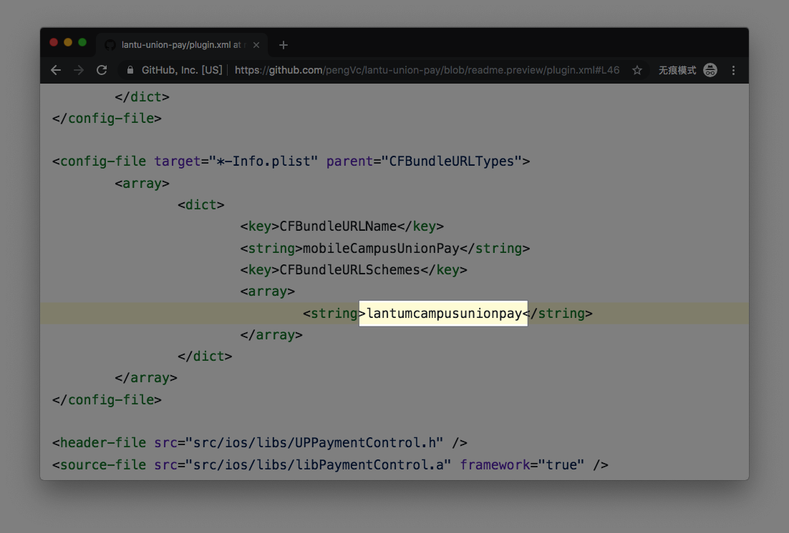

# lantu-union-pay #

[银联手机控件](https://open.unionpay.com/tjweb/acproduct/list?apiservId=450) cordova 插件

## 简介

[集成银联手机控件](https://open.unionpay.com/ajweb/help/file/techFile?productId=3):
- Android 手机支付控件开发包(安卓版)3.4.5
- IOS 手机支付控件开发包(iOS版)3.3.11


### 安装方法

```

cordova plugin add https://gitee.com/lantutech/lantu-union-pay.git

```

### 使用方法

```javascript

cordova.plugins.LantuUnionPay.pay(options, success, error);

```

#### 参数

__- { Object } options:__
* { String } tn - 银联交易流水号(支付空间使用)
* { String } [mode] - 支付模式, "00"代表接入生产环境（正式版本需要)、01"代表接入开发测试环境（测试版本需要）
* { String } [scheme] -  ios scheme for host'app, 一般情况不传


__- { Function } success:__
支付成功回调:

```javascript
function success(payResult){ 

	/**
	 * 支付结果
	 * @type { Object } payResult
	 * @property { String } code 支付结果, 候选值 "success"、"fail"、"cancel"
	 * @property { successPaySignData } [successExtraData] 仅有成功时返回
	 */
	payResult;
	
	
	/**
	 * 额外迁移数据( 银联也建议不在客户端做处理, 忽略就好 )
	 * @typedef { Object } successPaySignData
	 * @property { String } sign 签名后做Base64的数据
	 * @property { String } data 用于签名的原始数据，结构如: pay_result=success&tn=899394085660622736701&cert_id=68759585097
	 */
	
}
```

__- { Function } error:__
支付失败回调:

```javascript
function error(payResult){ 

	/**
	 * 支付结果
	 * @type { Object } payResult
	 * @property { String } code 支付结果, 候选值 "success"、"fail"、"cancel"
	 */
	payResult;

}
```

<br>

_example:_
```javascript
cordova.plugins.LantuUnionPay.pay({
	
	// 可用银联提供仿真tn 进行测试: http://101.231.204.84:8091/sim/getacptn
	tn: "539872438627557871701"
	
}, (payResult) => {
	
	const { code, successPaySignData } = payResult;
	alert(`支付成功 ${ code } !`);
	
	console.log("仅有成功时返回: ", successPaySignData);
	
}, (payResult) => {
	
	const { code } = payResult;
	alert(`支付失败 ${ code }`);
	
});

```

<br>

### 注意事项


#### ios 支付结束结果返回到 app 机制

手机控件是通过 URL Types回调协议, 因此需要在 Xcode 中配置 info.plist 配置 URL TYPES. 

lantu-union-pay 插件在安装时候已经做了这一件事, 默认值为 `lantumcampusunionpay`


如果有需求调整此配置项, 可自行在插件安装时候, 带上定制的参数( `-variable UNION_PAY_URL=*` ), 例如:

```

cordova plugin add https://gitee.com/lantutech/lantu-union-pay.git --variable UNION_PAY_URL=YourCustomizedUrl

```

<br>


### Todo 清单

- [x] IOS 安装时候提供 scheme variable 参数
- [ ] 兼容 cordova-android@7、cordova-android@8
- [ ] 补全 pkg.json 遗失的 cordova 版本等依

<br>

### Release Log

+ v0.2.4: 
	+ 修复 ios 在已安装云闪付APP 场景下, 成功支付后崩溃的问题

+ v0.2.3: 
	+ 新增 插件安装时 定制 UNION_PAY_URL 参数
	+ 修复 无法正确拿到支付回调结果

+ v0.2.2: 
	+ 实现 Android、IOS 核心支付方法, 并在 cordova@8、cordova-android@6.4.1 、cordova-ios@4.5.4 完成测试
